## A Galaxy's Hope

## Trello Board:
https://trello.com/b/hwPZWquO/ics-485-game-project

## Seed/Hook
* Bullet-hell game combined with rhythm where you fight constellations

## World
* Space with black holes and stars
* Each boss has its own personality, bosses based on constellations

## Emotion/Mood/Tone
* Satisfaction when dodging attacks/bullets
* Intense with all the colors and bullets coming at you
* Fast-paced must dodge bullets in order to survive

## Goals
* Avoid obstacles and eliminate the boss to reach the end of the song and go to the next level

## Sequence in achieveing goals
* As the level goes on, more bullets spawn
* As the level progresses the boss' attacks become more complex

## Obstacles
* Bullets to dodge and weave through

## Interaction
* Bullets shoot when music plays and works with the music
* Use the mouse to move your character to dodge bullets

## Rules
* Confined space so much dodge in order to survive
* Shoot the boss enemy in order to end the level
* Player can dash through objects that can harm the player. During that dash, they grant temp immunity

## Rewards
* Completeing a level allows you to move onto the next level

## What Happens in the Next Level
* New song in a new level
* More complicated bullet patterns
* Each level has a different song

## Summary
Intense bullet-hell rhythm game about fighting constellations in space, where you play as a dying star who avoids obstacles to find a place to live

## 3D Assets 

### Star

##### Front

##### Side

### Meteors 

1. 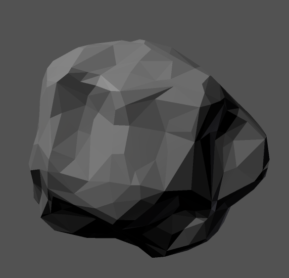
2. 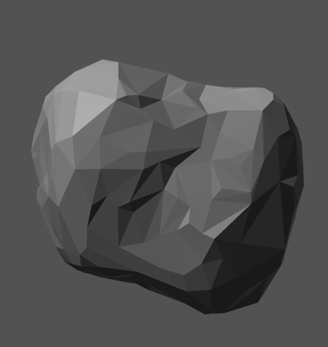
3. 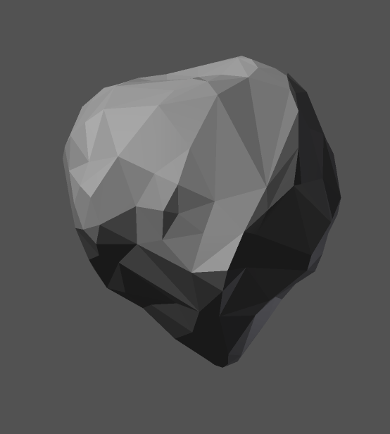
4. 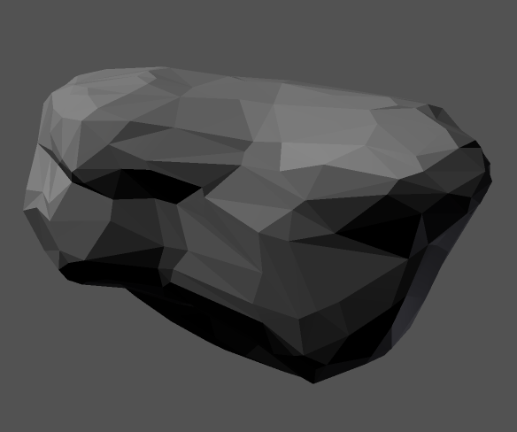

##### Front 
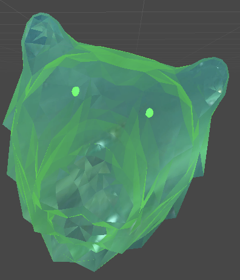

##### Side 
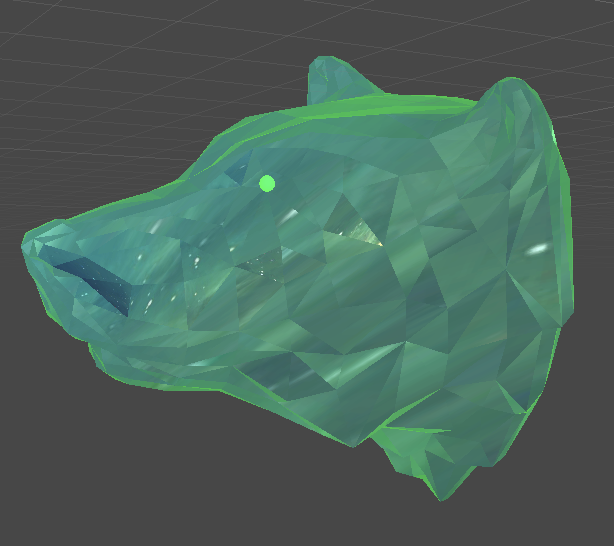

### Serpent Boss 

##### Front 
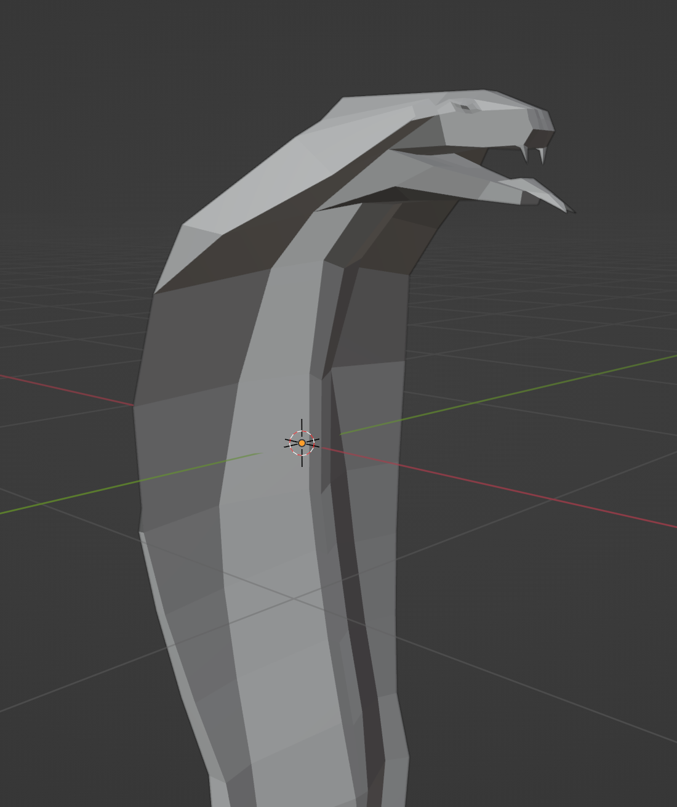
##### Back 
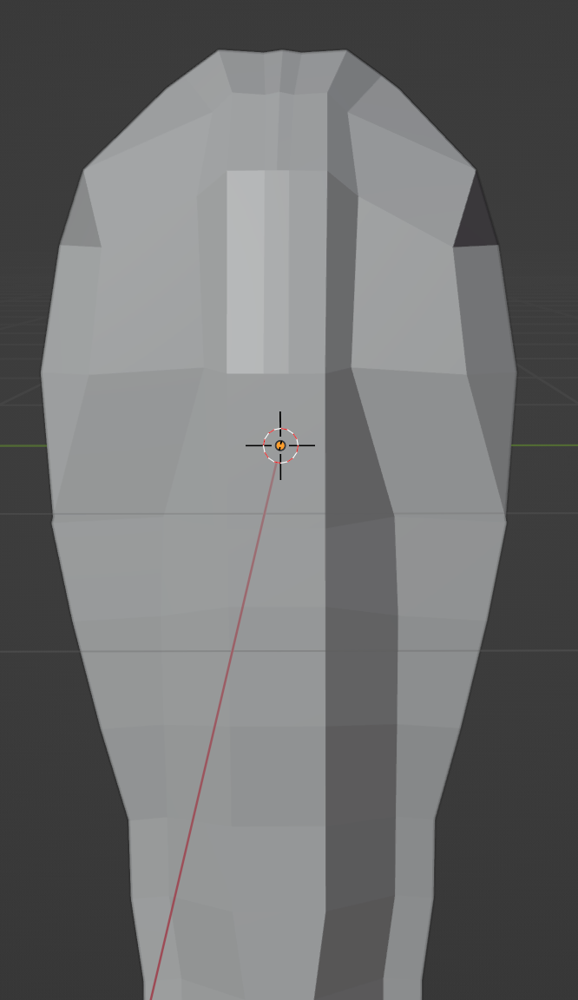

### Planet Model

##### Front
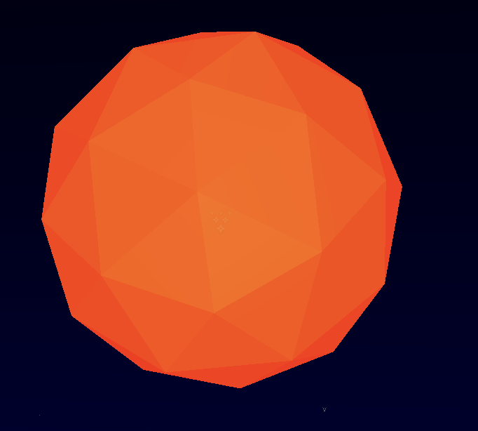

##### Side
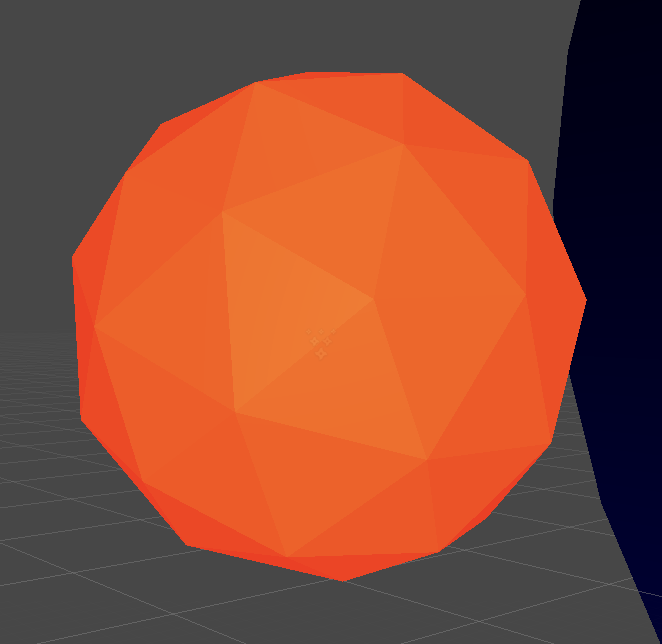

## Final Game Screens

### Title 
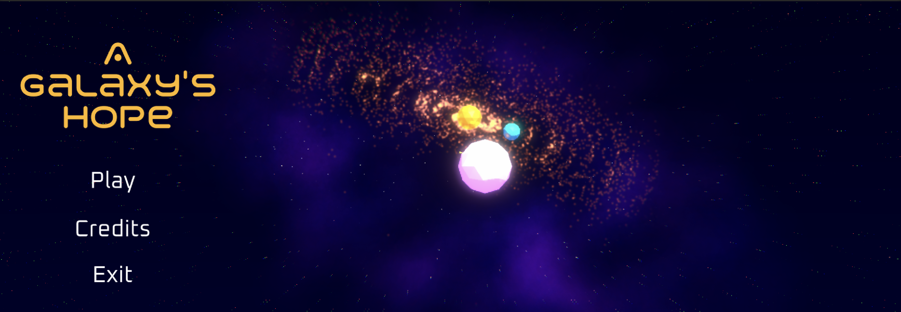

### Level Select 
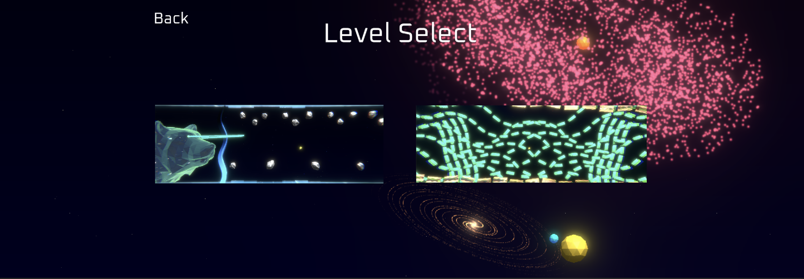

### Serpent Level
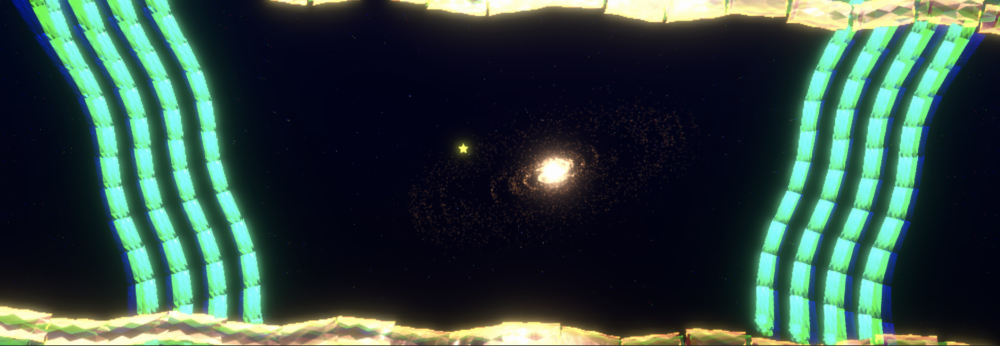

### Ursa Major Level 
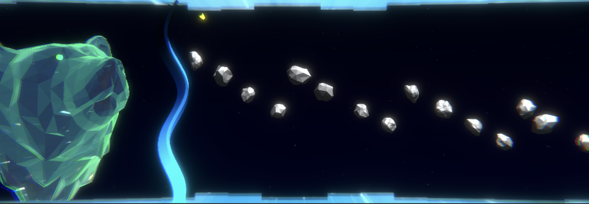

### Credits 
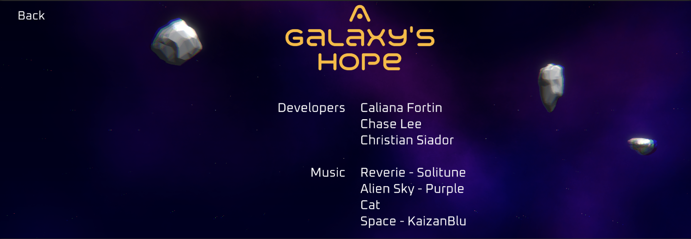

## Game Demo

## Inspiration

# Caliana
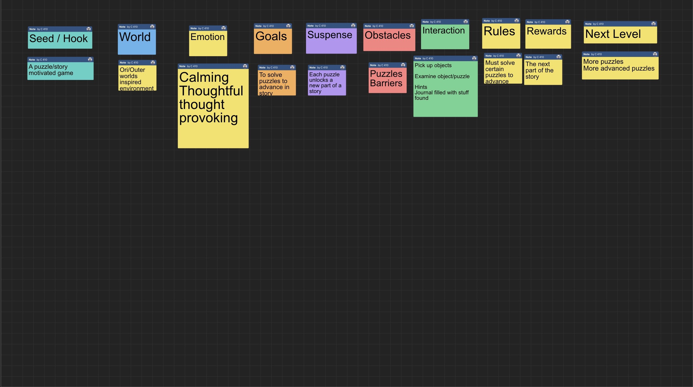
# Chase
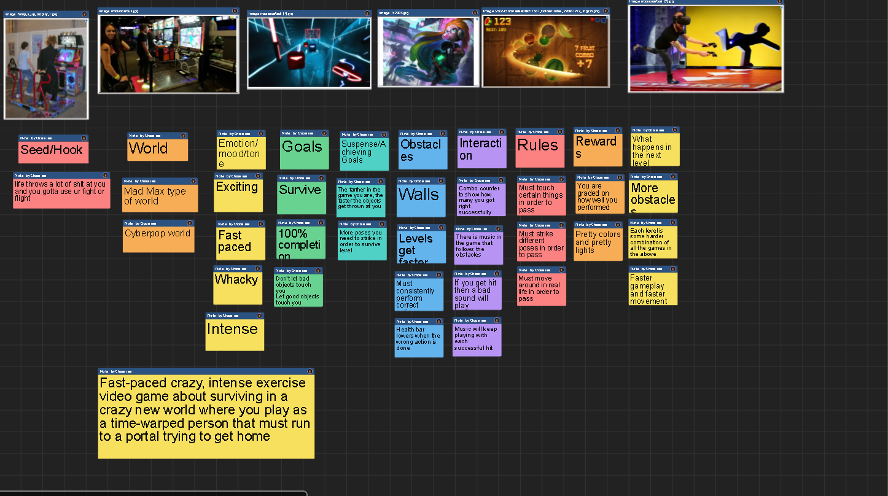
# Christian
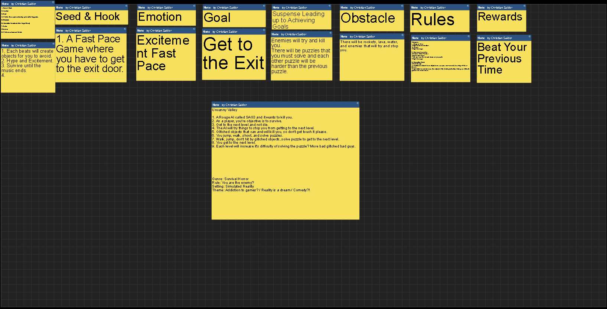

