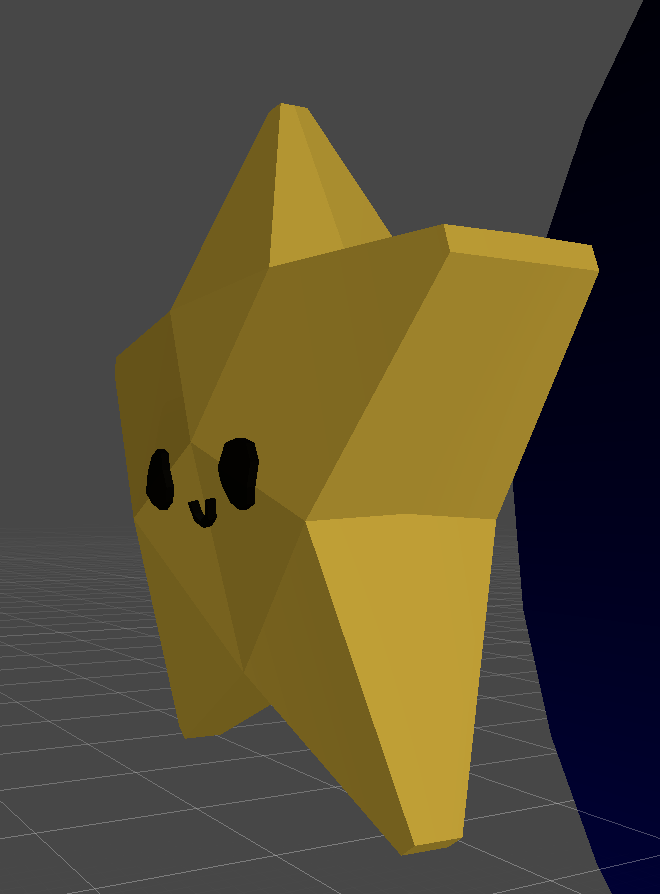
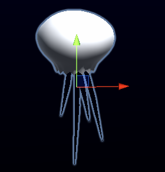
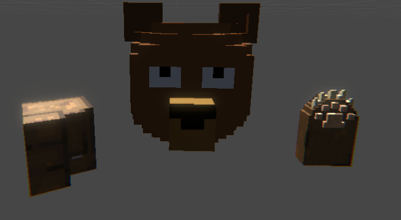
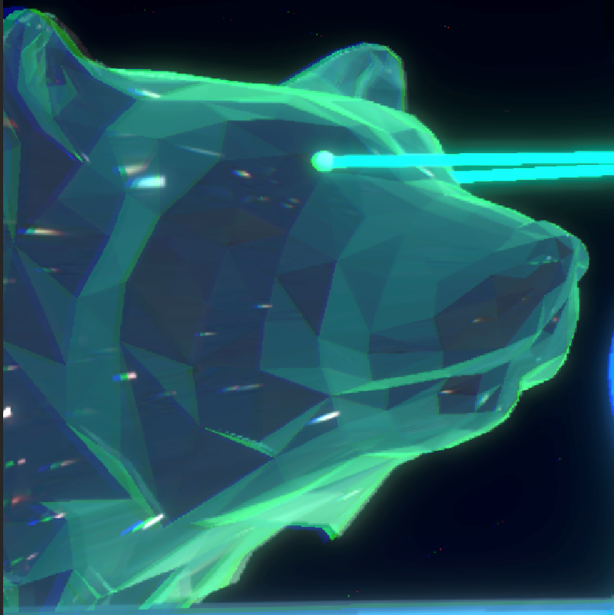
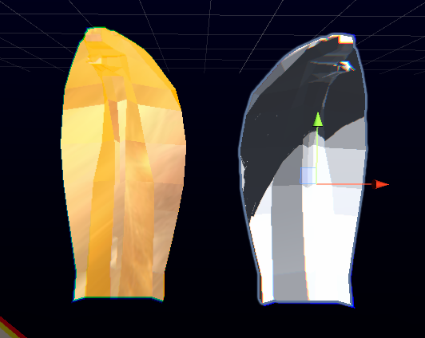
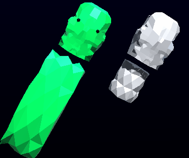

## A Galaxy's Hope
Itch.io WebGL Player [here](https://snekuchan.itch.io/a-galaxys-hope)
* Desktop download is available on the itch.io page at the bottom of the webpage
* **HIGHLY RECOMMENDED FOR DESKTOP DOWNLOAD**

## Description
A Galaxy's Hope is a game where you play as a star that is trying to survive an onslaught attack from a celestial body. This is a bullet-hell game where you are supposed to dodge all the incoming obstacles to survive. There are two celestial bodies to play against currently, Ursa Major and Serpens. Ursa Major uses meteors to attack the star that she creates using her celestial body. Serpens creates a plethora of long snakes to constrict the player's movements to try and suffocate the small starling.

## Trello Board:
https://trello.com/b/hwPZWquO/ics-485-game-project

## Seed/Hook
* Bullet-hell game combined with rhythm where you fight constellations

## World
* Space with black holes and stars
* Each boss has its own personality, bosses based on constellations

## Emotion/Mood/Tone
* Satisfaction when dodging attacks/bullets
* Intense with all the colors and bullets coming at you
* Fast-paced must dodge bullets in order to survive

## Goals
* Avoid obstacles and eliminate the boss to reach the end of the song and go to the next level

## Sequence in achieveing goals
* As the level goes on, more bullets spawn
* As the level progresses the boss' attacks become more complex

## Obstacles
* Bullets to dodge and weave through

## Interaction
* Bullets shoot when music plays and works with the music
* Use the mouse to move your character to dodge bullets

## Rules
* Confined space so much dodge in order to survive
* Shoot the boss enemy in order to end the level
* Player can dash through objects that can harm the player. During that dash, they grant temp immunity

## Rewards
* Completeing a level allows you to move onto the next level

## What Happens in the Next Level
* New song in a new level
* More complicated bullet patterns
* Each level has a different song

## Summary
Intense bullet-hell rhythm game about fighting constellations in space, where you play as a dying star who avoids obstacles to find a place to live

## 3D Assets 

### Star

##### Front

##### Side

### Meteors 

1. 
2. 
3. 
4. 

### JellyFish 

### Ursa Major 

##### Prototype Model Front 

##### Final Model Front 

##### Final Model Side 

### Serpent Boss 

##### Front 

##### Back 

##### Small Snake 

### Planet Model

##### Front

##### Side

## Final Game Screens

### Title 

### Level Select 

### Serpent Level

### Ursa Major Level 

### Credits 

## Game Prototype Demo
 

## Final Game Demo

## Inspiration

# Caliana

# Chase

# Christian

